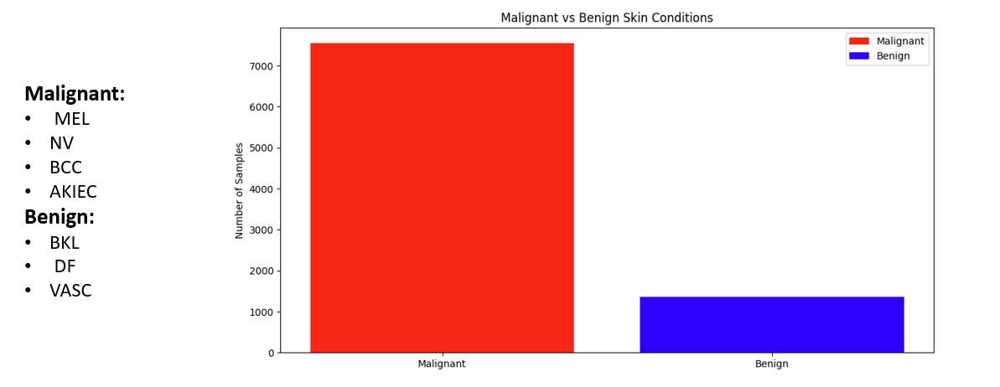
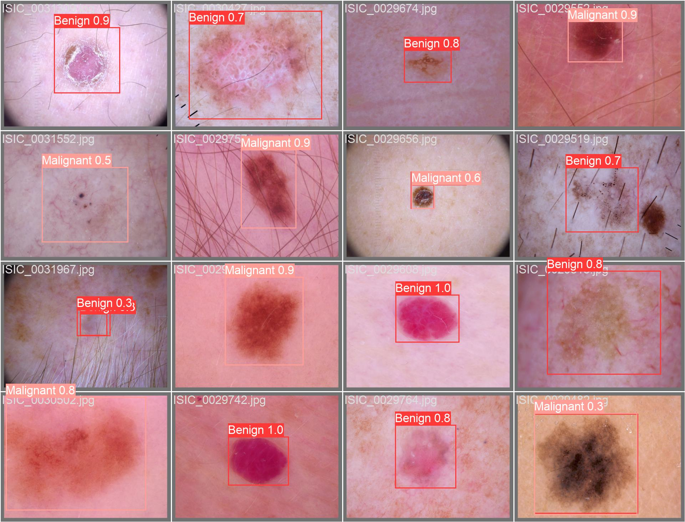

# Skin Cancer Detection with YOLOv8

## Objective
This project aims to detect skin cancer using the HAM10000 dataset by transforming segmentation masks into bounding box annotations and converting multi-class lesion classifications into a binary detection problem (cancerous vs non-cancerous). The implementation utilizes YOLOv8, a state-of-the-art object detection model, to achieve accurate lesion detection and classification.

## Dataset: HAM10000
The Lesions Segmentation dataset includes skin lesion images with segmentation masks and multi-class labels. This project preprocesses the dataset for binary classification and object detection.

**Source:** HAM10000 Dataset

## Data Preprocessing

### Convert Segmentation Masks to Bounding Boxes
Convert segmentation masks into bounding box annotations by computing the minimum enclosing rectangle for each lesion mask. This process involves finding the leftmost, rightmost, topmost, and bottommost pixels of the segmented region to create tight bounding boxes around the lesions.

### Binary Label Transformation
Transform the multi-class lesion labels into a binary classification: malignant lesions (cancerous) are labeled as 1, while benign lesions (non-cancerous) are labeled as 0.

### Data Balancing (Down Sampling)
Downsample the majority class (benign) to address class imbalance, ensuring balanced representation between cancerous and non-cancerous samples.

### Dataset Split
Split into training, validation and test sets for fair model evaluation.

## Reason for Object Detection
Object detection is essential for identifying and localizing skin lesions while distinguishing them from healthy skin regions. Unlike classification and segmentation approaches, object detection models can simultaneously detect multiple lesions and determine their precise locations in images, making them more suitable for real-world clinical applications where images often contain both affected and unaffected skin areas.

## Model Training: YOLOv8

### YOLOv8
YOLO version 8 - improved performance. Trained on the same dataset to compare with YOLOv5. Achieved:
- mAP@50: 90%
- mAP@50-95: 74%

## Training Pipeline

### Data Augmentation
Techniques like rotation, scaling and flipping increase training data diversity.

### Model Configuration
Tune hyperparameters (learning rate, batch size, epochs) for optimal performance. Adjust specific augmentations and configurations for skin lesion images.

### Evaluation Metrics
- mAP@50: Average precision at 50% IoU threshold.
- mAP@50-95: Average precision across multiple IoU thresholds for comprehensive evaluation.

## Results
Best Performance - YOLOv8:
- mAP@50: 90%
- mAP@50-95: 74%

